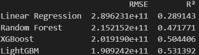

# ML-7Team

## 👋🏻 7 Team 팀원소개
| 김정원 | 김한솔 | 백미송 |
| --- | --- | --- |
|  |   |   |
---
### **🔍 주요 내용**
- 데이터 로드 및 전처리
- 변수별 분석 및 시각화
- 머신러닝을 위한 데이터 변환 
---
### 💡인사이트
- 건물 크기가 방 개수, 욕실 개수에 큰 영향을 받는 점을 보아, 멜버른의 집값은 건물 크기에 가장 큰 영향을 받음
- 그 외로는 주택 유형과 건물 연식과 상관관계를 볼 수 있음
---

### 🗂️데이터셋 소개
  - **Melbourne Housing Snapshot**
  - 출처: Kaggle (https://www.kaggle.com/datasets/dansbecker/melbourne-housing-snapshot/data)

#### **변수에 대한 설명**
  - Rooms: 방 개수
  - Price: 가격 (달러)
  - Method: 판매 방식
    - S: 매물 판매됨
    - SP: 사전 판매됨
    - PI: 경매에서 유찰됨
    - PN: 사전 판매되었으나 가격 미공개
    - SN: 판매되었으나 가격 미공개
    - NB: 입찰 없음
    - VB: 판매자가 제시한 입찰가
    - W: 경매 전에 철회됨
    - SA: 경매 후 판매됨
    - SS: 경매 후 판매되었으나 가격 미공개
    - N/A: 가격 또는 최고 입찰가 정보 없음
  - Type: 주택 유형
    - br: 침실 개수
    - h: 단독주택, 코티지, 빌라, 반단독주택, 테라스하우스
    - u: 유닛, 듀플렉스(다세대주택)
    - t: 타운하우스
    - dev site: 개발 가능 부지
    - o res: 기타 주거용 부동산
  - SellerG: 부동산 중개업자
  - Date: 판매 날짜
  - Distance: 도심 (CBD)까지의 거리
  - Regionname: 지역명 (서부, 북서부, 북부, 북동부 등)
  - Propertycount: 해당 지역에 존재하는 부동산 수
  - Bedroom2: 다른 출처에서 수집한 침실 개수
  - Bathroom: 욕실 개수
  - Car: 주차 가능 차량 수
  - Landsize: 토지 크기
  - BuildingArea: 건물 크기
  - CouncilArea: 해당 지역의 관할 지방정부
---
### EDA
1. 데이터 로드

     
    
2. 데이터 구조 및 기초통계 확인

   
    

3. 결측치 및 이상치 탐색

    
    
    

4. 데이터 시각화를 통한 탐색

    
    
    

5. 데이터 정제 및 전처리

     
   
   
     
   

6. Appendix

    
    
## 7. Machine Learning
- 사용 모델
   - Linear Regression : 회귀 모델 중 가장 기본이 되는 모델
   - RandomForestRegressor : 결정트리를 활용한 배깅의 대표적 알고리즘
   - XGBRegressor : 트리 기반의 모델이지만 모델의 성능을 향상시키기 위해 학습률을 사용
   - LGBMRegressor : XGB의 단점을 보완
### Features: rooms, buildingarea, car, postcode (4개 변수)

| n_estimators | Learning Rate | RMSE , R² | XGB Feature Importance |
|-------------|--------------|----------|----------|
| 100         | 0.01         |  |  |
| 100         | 0.1          |  | |
| 200         | 0.01         |  |  |
| 200         | 0.1          |  |  |

---

### Features: rooms, buildingarea, yearbuilt, type_code, bedroom2, bathroom, car (7개 변수)

| n_estimators | Learning Rate | RMSE , R² | XGB Feature Importance |
|-------------|--------------|----------|----------|
| 100         | 0.01         |  |  |
| 100         | 0.1          |  |  |

### Features: rooms, buildingarea, car, postcode, yearbuilt, typecode (6개 변수)

| n_estimators | Learning Rate | RMSE , R² | XGB Feature Importance |
|-------------|--------------|----------|----------|
| 100         | 0.01         |  |  |
| 100         | 0.1          |  |  |

### Features: rooms, buildingarea, yearbuilt, type_code (4개 변수)

| n_estimators | Learning Rate | RMSE , R² | XGB Feature Importance |
|-------------|--------------|----------|----------|
| 100         | 0.01         |  |  |
| 100         | 0.1          |  |  |

## 8. 모델 비교 결과
- 데이터의 분포가 선형성을 띄지 않아 Linear Regression의 결과가 매우 안좋음.
- XGBRegression과 LGBMRegression의 성능이 대체적으로 좋았음.
- feature을 바꿔가며 비교해 본 결과, 개수가 너무 적으면 성능이 떨어졌고 Price와의 상관관계가 비교적 높은 feature들을 사용했을 때 성능이 좋았음.

## 9. 기대효과
- 집의 방 개수, 대지 면적에 따라 멜버른의 집값을 예측할 수 있음.
- 위도, 경도 등 위치 데이터를 이용하면 멜버른의 어느 지역의 집값이 높은지 확인할 수 있음.